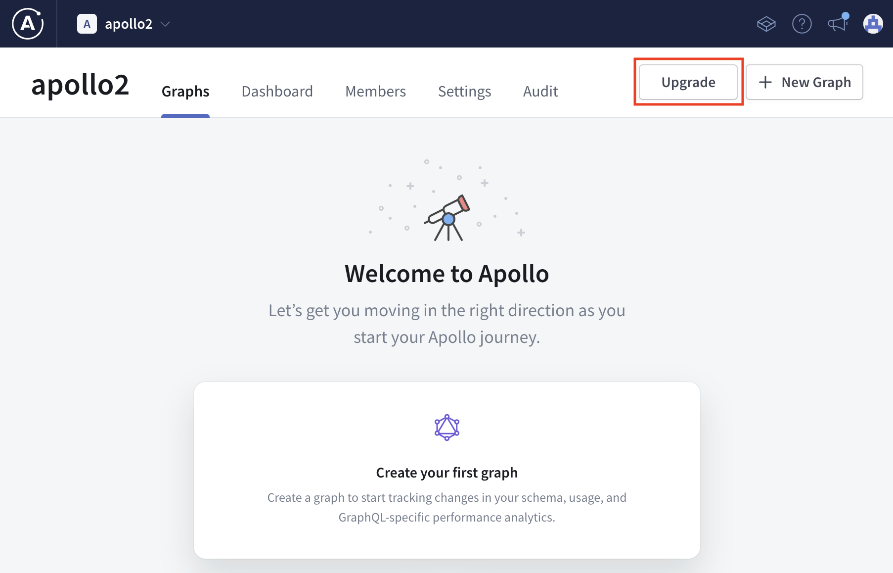

# Hack the Supergraph

Welcome to GraphQL Summit '22, the year of the Supergraph.

As you start your journey exploring, you find an old relic that has information of locations all over space. The little box looks old and isn't that fast, but it seems to get the job done. You grab the box and think of all the galaxies you can discover with it. *You have to put this in your Supergraph so others can access it also, you never know when you meet a space friend.*

You're going to need to grab your tools before starting this journey:

- Create your Supergraph account at [studio.apollographql.com](https://studio.apollographql.com/signup)
  - If you have an Enterprise Apollo account, you'll need to create a personal account for the hackathon.

  - If you already have an Apollo account, you'll  either have to upgrade your account to the free serverless plan or create a new account for the conference.

- Download [rover] to help develop your Supergraph

Once you've done everything above, head to the [`start`](./start/) folder to begin your journey of the cosmic Supergraph! There are three subgraph stations (*cosmic-cove*, *solar-seas* or *space-beach*) you can complete after finishing the [`start`](./start/).

[rover]: https://www.apollographql.com/docs/rover/