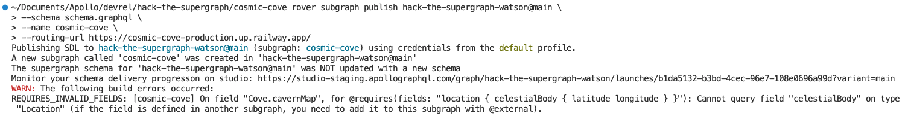
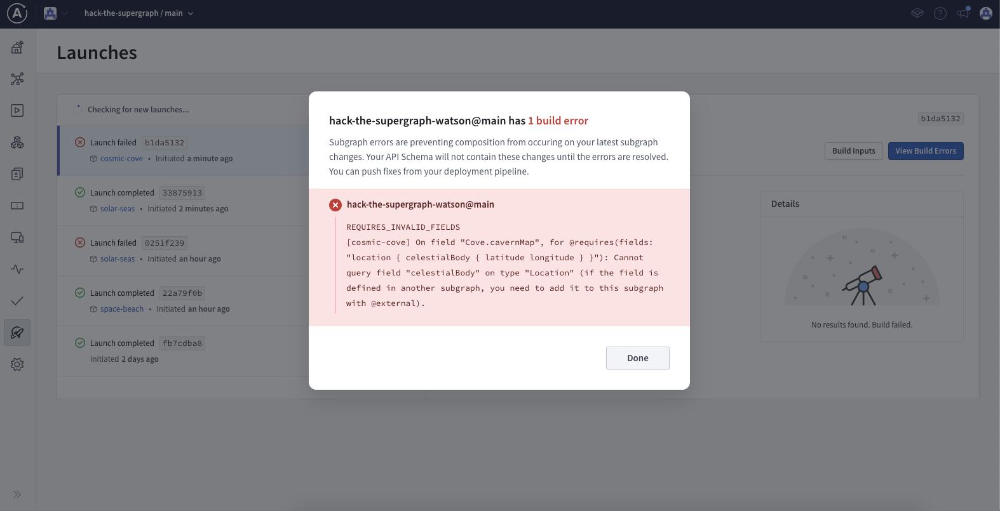
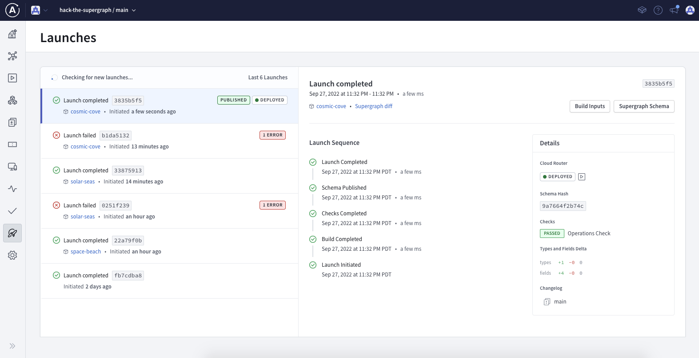
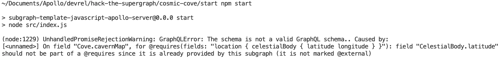

# Cosmic Cove - Hack the Supergraph

The coves found throughout the cosmos are large and daunting. Many travelers have been lost without a map of the cavern they are exploring. That's why the Intergalactic Society of Cavern Explorers published the a datasource that let's anyone get cavern map data with just the galactic latitude and longitude of the cove. We'll use this data with a list of coves we've been wanting to explore.

## Summary

At this subgraph station, you'll be using `@requires` to require specific information from an external subgraph. In our scenario, we'll be requiring the exact location coordinates to create a map of the coves caverns. We'll use `@external` which will tell the graph router that it needs to fetch the values of those externally defined fields first, even if the original client query didn't request them.

## What you'll learn

- Using external subgraph fields using `@requires` and `@external`
- Using [rover] to publish your subgraph schema into your Supergraph
- Using [rover] to validation your subgraph schema with your Supergraph
- If you want to code...
  - Creating a new subgraph using `rover template`

<details>
 <summary><h2>I don't want to write code...</h2></summary>

For this station, the schema for coves has already been put together for you. We just need to add the `cavernMap` data to our `Cove`:

```graphql
extend schema
  @link(
    url: "https://specs.apollo.dev/federation/v2.0"
    import: [ "@key", "@shareable" ]
  )

type Query {
  coves: [Cove]
}

type Cove @key(fields: "id") {
  id: ID!
  location: Location
}

type Location @key(fields: "id") {
  id: ID!
}

type CelestialBody @shareable {
  latitude: Float!
  longitude: Float!
}
```

First, we'll need to add the appropriate [Apollo Federation directives]. Since the cavern map is going to require location information, we'll need to add `@requires`:

```graphql
extend schema
  @link(
    url: "https://specs.apollo.dev/federation/v2.0"∂
    import: [ "@key", "@shareable", "@requires"]
  )
```

Now we can add our `cavernMap` data to the `Cove` type and require the appropriate fields from the `location`:

```graphql
type Cove @key(fields: "id") {
  id: ID!
  location: Location
  cavernMap: [Float]
    @requires(fields: "location { celestialBody { latitude longitude } }")
}
type Location @key(fields: "id") {
  id: ID!
  celestialBody: CelestialBody! 
}
type CelestialBody @shareable {
  latitude: Float!
  longitude: Float!
}
```

Finally, we can add this into our Supergraph by publishing it using [rover].

First, you'll need to [Configure rover] for your Supergraph. Once rover is configured, we can use the `rover subgraph publish` command

```shell
rover subgraph publish {YOUR_SUPERGRAPH_ID}@main \
  --schema "./schema.graphql" \
  --name cosmic-cove \
  --routing-url "https://cosmic-cove-production.up.railway.app/"
```

>*NOTE: make sure to replace {YOUR_SUPERGRAPH_ID} with the id of the Supergraph you created at the start of the hackathon*

Uh oh... it looks like there was a problem with the schema:



We can also see the build errors in the launches tab:



If we read through the build error, we can see that we're missing an `@external` directive since the `location` information is coming from the subgraph we created at the start of the hackathon.

>Cannot query field "celestialBody" on type "Location" (if the field is defined in another subgraph, you need to add it to this subgraph with @external).

It's great to see that our error didn't break the Supergraph; failing builds don't cause any downtime. We can update our Supergraph by fixing the build error, but we can also check our schema is valid prior to publishing it.

Try running the rover command for schema validation:

```shell
rover subgraph check {YOUR_SUPERGRAPH_ID}@main \
  --schema "./schema.graphql" \
  --name cosmic-cove \
```

Not only does this validate your schema will compose, it will also validate it against any production traffic for your Supergraph. This helps ensure we don't unknowingly break any of our clients consuming the graph 🎉

Since we are requiring the `location` field to get our `cavernMap` information, we'll need to import `@external` and add it to the `celestialBody` field:

```graphql
extend schema
  @link(
    url: "https://specs.apollo.dev/federation/v2.0"∂
    import: [ "@key", "@shareable", "@requires", "@external" ]
  )
type Cove @key(fields: "id") {
  id: ID!
  location: Location
  cavernMap: [Float]
    @requires(fields: "location { celestialBody { latitude longitude } }")
}

type Location @key(fields: "id") {
  id: ID!
  celestialBody: CelestialBody! @external
}

type CelestialBody @shareable {
  latitude: Float!
  longitude: Float!
}
```

Now let's re-publish this schema into our Supergraph:

```shell
rover subgraph publish {YOUR_SUPERGRAPH_ID}@main \
  --schema "./schema.graphql" \
  --name cosmic-cove \
  --routing-url "https://cosmic-cove-production.up.railway.app/"
```

We can see our Supergraph deployment in the "Launches" tab:


</details>

---

<details>
 <summary><h2>I want to write code...</h2></summary>

For this station, the project for coves has already been put together for you. We just need to add the cavernMap data to our Cove. You can find the starting code in the `cosmic-cove-start` folder.

First, we'll need to add the appropriate [Apollo Federation directives]. Since the cavern map is going to require location information, we'll need to add `@requires`:

```graphql
extend schema
  @link(
    url: "https://specs.apollo.dev/federation/v2.0"∂
    import: [ "@key", "@shareable", "@requires"]
  )
```

Now we can add our `cavernMap` data to the `Cove` type and require the appropriate fields from the `location`:

```graphql
type Cove @key(fields: "id") {
  id: ID!
  location: Location
  cavernMap: [Float]
    @requires(fields: "location { celestialBody { latitude longitude } }")
}
type Location @key(fields: "id") {
  id: ID!
  celestialBody: CelestialBody!
}
type CelestialBody @shareable {
  latitude: Float!
  longitude: Float!
}
```

The `Cove` resolver has already been written for you, but you can see in `src/resolvers/Cove.js` that the `location` information we require is available on the `parent`. 

```javascript
module.exports = {
  Cove: {
    cavernMap(cove, args, context) {
      const { latitude, longitude } = cove.location.celestialBody;
      return context.coves.getCavernMap(latitude, longitude);
    }
    ...
  },
};
```

Now we can start up our subgraph and add it to our Supergraph stack locally with rover:

```shell
npm start
```

Uh oh... it looks like there was a problem with the schema:



It's nice that `@apollo/subgraph` has this validation, but there are also other tools in `rover` to validate a subgraph's schema. 

Try running the rover command for schema validation:

```shell
rover subgraph check {YOUR_SUPERGRAPH_ID}@main \
  --schema "./schema.graphql" \
  --name cosmic-cove \
```

Not only does this validate your schema will compose, it will also validate it against any production traffic for your Supergraph. This helps ensure we don't unknowingly break any of our clients consuming the graph 🎉

Ideally this is something we can run in CI on every pull request. There is an example of this in the `cosmic-cove/.github` folder; there is a similar template for any templates available in `rover template use`.

Since we are requiring the `location` field to get our `cavernMap` information, we'll need to import `@external` and add it to the `celestialBody` field:

```graphql
extend schema
  @link(
    url: "https://specs.apollo.dev/federation/v2.0"∂
    import: [ "@key", "@shareable", "@requires", "@external" ]
  )
type Cove @key(fields: "id") {
  id: ID!
  location: Location
  cavernMap: [Float]
    @requires(fields: "location { celestialBody { latitude longitude } }")
}
type Location @key(fields: "id") {
  id: ID!
  celestialBody: CelestialBody! @external
}
type CelestialBody @shareable {
  latitude: Float!
  longitude: Float!
}
```

Finally, we can add this into our Supergraph by publishing it using [rover].

First, you'll need to [Configure rover] for your Supergraph. Once rover is configured, we can use the `rover subgraph publish` command

```shell
rover subgraph publish {YOUR_SUPERGRAPH_ID}@main \
  --schema "./schema.graphql" \
  --name cosmic-cove \
  --routing-url "https://cosmic-cove-production.up.railway.app/"
```

>*NOTE: make sure to replace {YOUR_SUPERGRAPH_ID} with the id of the Supergraph you created at the start of the hackathon*

We can see our Supergraph deployment in the "Launches" tab:


</details>

---

Congratulations, you've completed Cosmic Cove! Head to either *solar-seas* or *space-beach* next.
