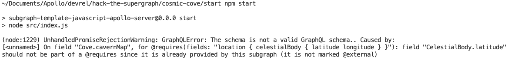

# Cosmic Cove - Hack the Supergraph

For this station, the subgraph for coves has already been put together for you. We just need to add the cavernMap data to our Cove.

First, we'll need to import the appropriate [Apollo Federation directives] within `schema.graphql`. Since the cavern map is going to _require_ location information from the `start` subgraph, we'll need to import `@requires` via `@link`:

```graphql
extend schema
@link(
  url: "https://specs.apollo.dev/federation/v2.0"
  import: ["@key", "@shareable", "@requires"]
)
```

Now we can add our `cavernMap` data to the `Cove` type and require the appropriate fields from the `location`:

```graphql
type Cove @key(fields: "id") {
  id: ID!
  location: Location
  cavernMap: [Float]
  @requires(fields: "location { celestialBody { latitude longitude } }")
}
```

The `Cove` resolver has already been written for you. You can see in `src/resolvers/Cove.js` that the `location` information we require is available on the `parent` (named `cove` here). This is what that `@requires` directive is doing for us.

```javascript
module.exports = {
    Cove: {
        cavernMap(cove, args, context) {
            const {latitude, longitude} = cove.location.celestialBody;
            return context.coves.getCavernMap(latitude, longitude);
        }
        ...
    },
};
```

Now we can start up our subgraph and add it to our Supergraph stack locally with rover:

```shell
npm install
npm start
```

Uh oh... it looks like there was a problem with the schema:



It's nice that `@apollo/subgraph` has this validation, but there are also other tools in `rover` to validate a subgraph's schema.

Try running the rover command for schema validation:

```shell
rover subgraph check {YOUR_SUPERGRAPH_ID}@main \
  --schema "./schema.graphql" \
  --name cosmic-cove \
```

Not only does this validate your schema will compose, it will also validate it against any production traffic for your Supergraph. This helps ensure we don't unknowingly break any of our clients consuming the graph 🎉

Ideally this is something we can run in CI on every pull request. There is an example of this in the `cosmic-cove/.github` folder; there is a similar template for any templates available in `rover template use`.

Since we are requiring the `location` field to get our `cavernMap` information, we'll need to import `@external` and add it to the `celestialBody` field:

```graphql
extend schema
@link(
  url: "https://specs.apollo.dev/federation/v2.0"
  import: [ "@key", "@shareable", "@requires", "@external" ]
)
type Cove @key(fields: "id") {
  id: ID!
  location: Location
  cavernMap: [Float]
  @requires(fields: "location { celestialBody { latitude longitude } }")
}
type Location @key(fields: "id") {
  id: ID!
  celestialBody: CelestialBody! @external
}
type CelestialBody @shareable {
  latitude: Float!
  longitude: Float!
}
```

Finally, we can add this into our Supergraph by publishing it using [rover].

First, you'll need to [configure rover] for your Supergraph. Once rover is configured, we can use the `rover subgraph publish` command

```shell
rover subgraph publish {YOUR_SUPERGRAPH_ID}@main \
  --schema "./schema.graphql" \
  --name cosmic-cove \
  --routing-url "https://cosmic-cove-production.up.railway.app/"
```

> _NOTE: make sure to replace {YOUR_SUPERGRAPH_ID} with the id of the Supergraph you created at the start of the hackathon_

We can see our Supergraph deployment in the "Launches" tab:


---

Congratulations, you've completed Cosmic Cove! Head to either _solar-seas_ or _space-beach_ next.

[apollo federation directives]: https://www.apollographql.com/docs/federation/federated-types/federated-directives

[rover]: https://www.apollographql.com/docs/rover/

[configure rover]: https://www.apollographql.com/docs/rover/configuring
