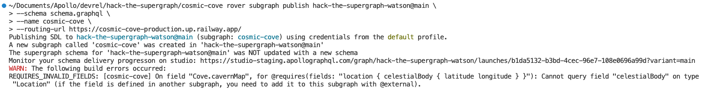
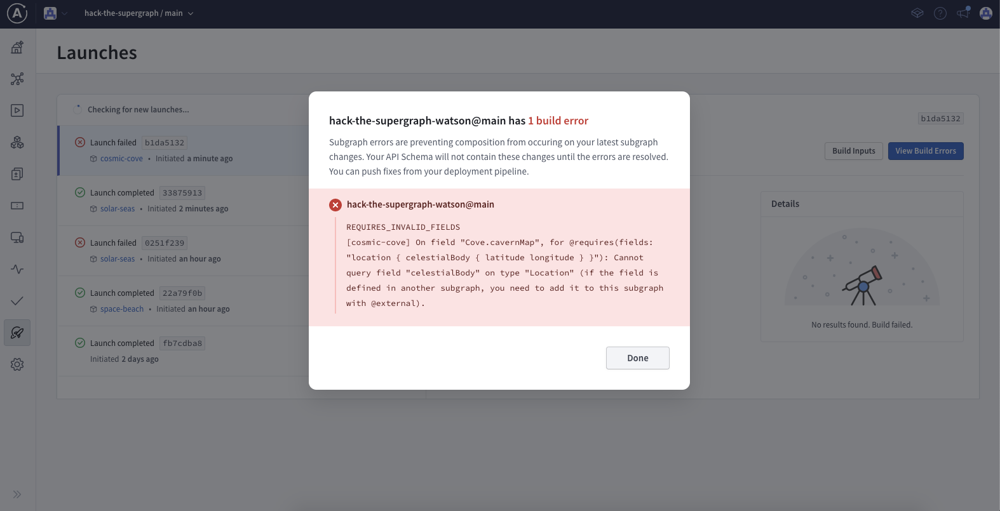

# Cosmic Cove - Hack the Supergraph

We're constructing the `cosmic-cove` subgraph, which will expose the new `Cove` type to API consumers. That `Cove` type will have a `cavernMap` field to help explorers navigate the caverns.

```graphql
extend schema
  @link(
    url: "https://specs.apollo.dev/federation/v2.0"
    import: ["@key", "@shareable"]
  )

type Query {
  coves: [Cove]
}

type Cove @key(fields: "id") {
  id: ID!
  location: Location
  cavernMap: [Float]
}

type Location @key(fields: "id") {
  id: ID!
  celestialBody: CelestialBody!
}

type CelestialBody @shareable {
  latitude: Float!
  longitude: Float!
}
```

Notice that the `CelestialBody` type is added here even though that information comes from the `start` subgraph. This is because our new `cavernMap` field is going to require that information, so our subgraph has to know what it looks like.

We will change our `cavernMap` field to specify this requirement via the `@requires` directive:

```graphql
type Cove @key(fields: "id") {
  id: ID!
  location: Location
  cavernMap: [Float]
    @requires(fields: "location { celestialBody { latitude longitude } }")
}
```

`@requires` is an [Apollo Federation directive] so we need to import it via our `@link`:

```graphql
extend schema
  @link(
    url: "https://specs.apollo.dev/federation/v2.0"
    import: ["@key", "@shareable", "@requires"]
  )
```

The full schema so far should look like this:

```graphql
extend schema
  @link(
    url: "https://specs.apollo.dev/federation/v2.0"
    import: ["@key", "@shareable", "@requires"]
  )

type Query {
  coves: [Cove]
}

type Cove @key(fields: "id") {
  id: ID!
  location: Location
  cavernMap: [Float]
    @requires(fields: "location { celestialBody { latitude longitude } }")
}

type Location @key(fields: "id") {
  id: ID!
  celestialBody: CelestialBody!
}

type CelestialBody @shareable {
  latitude: Float!
  longitude: Float!
}
```

To summarize this subgraph schema:

1. Adds a new `coves` field to the `Query` type so that API consumers can access this new information.
2. Specifies a `Cove` entity which will be returned by the `coves` field.
3. Specifies a `cavernMap` field on the `Cove` entity which will require the `latitude` and `longitude` fields from the `celestialBody` field within the `location` field. That `celestialBody` field on the `Location` entity is provided by the `start` subgraph, our subgraph doesn't have that data yet!

Let's add the new subgraph into our Supergraph by publishing it using [rover].

First, you'll need to [configure rover] for your Supergraph if you haven't already. Once rover is configured, we can use the `rover subgraph publish` command within the _same directory as this README_. We're going to publish the included `schema.graphql` file which contains the above schema, like this:

```shell
rover subgraph publish {YOUR_SUPERGRAPH_ID}@main \
  --schema "./schema.graphql" \
  --name cosmic-cove \
  --routing-url "https://cosmic-cove-production.up.railway.app/"
```

> _NOTE: make sure to replace {YOUR_SUPERGRAPH_ID} with the id of the Supergraph you created at the start of the hackathon_

Uh oh... it looks like there was a problem with the schema:



We can also see the build errors in the launches tab:



If we read through the build error, we can see that we're missing an `@external` directive since the `celestialBody` information is coming from the subgraph we created at the start of the hackathon.

> Cannot query field "celestialBody" on type "Location" (if the field is defined in another subgraph, you need to add it to this subgraph with @external).

It's great to see that our error didn't break the Supergraph; failing builds don't cause any downtime. We can update our Supergraph by fixing the build error, but we can also check our schema is valid prior to publishing it.

Try running the rover command for schema validation:

```shell
rover subgraph check {YOUR_SUPERGRAPH_ID}@main \
  --schema "./schema.graphql" \
  --name cosmic-cove \
```

Not only does this validate your schema will compose, it will also validate it against any production traffic for your Supergraph. This helps ensure we don't unknowingly break any of our clients consuming the graph 🎉

Since we are requiring the `location` field to get our `cavernMap` information, we'll need to import `@external` and add it to the `celestialBody` field:

```graphql
extend schema
@link(
  url: "https://specs.apollo.dev/federation/v2.0"
  import: ["@key", "@shareable", "@requires", "@external"]
)

# ... other types omitted for brevity

type Location @key(fields: "id") {
  id: ID!
  celestialBody: CelestialBody! @external
}
```

That new schema is provided in `schema2.graphql` in this directory. Let's publish that schema to our Supergraph:

```shell
rover subgraph publish {YOUR_SUPERGRAPH_ID}@main \
  --schema "./schema2.graphql" \
  --name cosmic-cove \
  --routing-url "https://cosmic-cove-production.up.railway.app/"
```

We can see our Supergraph deployment in the "Launches" tab:


---

Congratulations, you've completed Cosmic Cove! Head to either _solar-seas_ or _space-beach_ next.

[apollo federation directives]: https://www.apollographql.com/docs/federation/federated-types/federated-directives

[rover]: https://www.apollographql.com/docs/rover/

[configure rover]: https://www.apollographql.com/docs/rover/configuring
