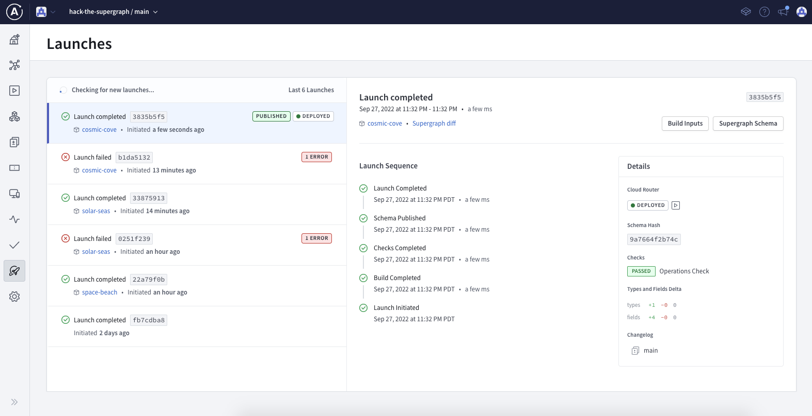

# Cosmic Cove - Hack the Supergraph

The coves found throughout the cosmos are large and daunting. Many travelers have been lost without a map of the cavern they are exploring. That's why the Intergalactic Society of Cavern Explorers published the a datasource that let's anyone get cavern map data with just the galactic latitude and longitude of the cove. We'll use this data with a list of coves we've been wanting to explore.

## Summary

At this subgraph station, you'll be using `@requires` to require specific information from an external subgraph. In our scenario, we'll be requiring the exact location coordinates to create a map of the coves caverns. We'll use `@external` which will tell the graph router that it needs to fetch the values of those externally defined fields first, even if the original client query didn't request them.

## What you'll learn

- Using external subgraph fields using `@requires` and `@external`
- Using [rover] to publish your subgraph schema into your Supergraph
- Using [rover] to validation your subgraph schema with your Supergraph

<details>
 <summary><h2>I don't want to write code...</h2></summary>

For this station, the schema for coves has already been put together for you:

```graphql
extend schema
  @link(
    url: "https://specs.apollo.dev/federation/v2.0"
    import: ["@key", "@shareable", "@requires", "@external"]
  )
type Query {
  coves: [Cove]
}
type Cove @key(fields: "id") {
  id: ID!
  location: Location
  cavernMap: [Float]
    @requires(fields: "location { celestialBody { latitude longitude } }")
}
type Location @key(fields: "id") {
  id: ID!
  celestialBody: CelestialBody! @external
}
type CelestialBody @shareable {
  latitude: Float!
  longitude: Float!
}

```

Before we push this schema into our Supergraph, let's look at how `@requires` and `@external` are being used.

In this subgraph, we've imported the `@requires` and `@external` [Apollo Federation directives]:

```graphql
extend schema
  @link(
    url: "https://specs.apollo.dev/federation/v2.0"∂
    import: [ "@key", "@shareable", "@requires"]
  )
```

With the proper directives imported, we can use `@requires` on the `Cove.cavernMap` to use the `Location.celestialBody` data in this subgraph. The `Location.celestialBody` field will also need `@external` to tell the graph router that the data is coming from an external subgraph:

```graphql
type Cove @key(fields: "id") {
  id: ID!
  location: Location
  cavernMap: [Float]
    @requires(fields: "location { celestialBody { latitude longitude } }")
}
type Location @key(fields: "id") {
  id: ID!
  celestialBody: CelestialBody! @external
}
type CelestialBody @shareable {
  latitude: Float!
  longitude: Float!
}
```

Before we publish our schema into the Supergraph with [rover], we can validate our schema to ensure our schema doesn't break the graph. 

In a new terminal window, try running the rover command for schema validation:

```shell
rover subgraph check {YOUR_SUPERGRAPH_ID}@main \
  --schema "./schema.graphql" \
  --name cosmic-cove \
```

Not only does this validate your schema will compose, it will also validate it against any production traffic for your Supergraph. This helps ensure we don't unknowingly break any of our clients consuming the graph 🎉

Now let's publish this schema into our Supergraph:

```shell
rover subgraph publish {YOUR_SUPERGRAPH_ID}@main \
  --schema "./schema.graphql" \
  --name cosmic-cove \
  --routing-url "https://cosmic-cove-production.up.railway.app/"
```

We can see our Supergraph deployment in the "Launches" tab:



---

Congratulations, you've completed Cosmic Cove! Head to either _solar-seas_ or _space-beach_ next.

[apollo federation directives]: https://www.apollographql.com/docs/federation/federated-types/federated-directives

[rover]: https://www.apollographql.com/docs/rover/

[configure rover]: https://www.apollographql.com/docs/rover/configuring
