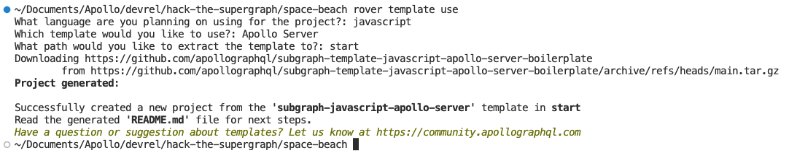
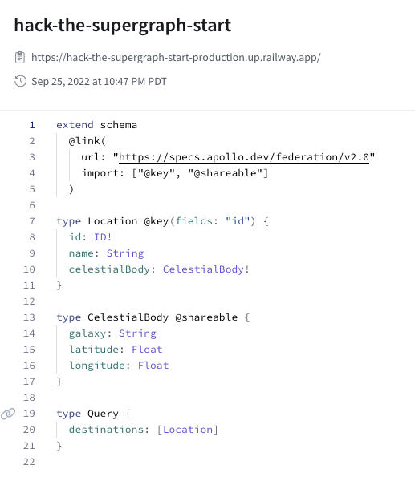

# Solar Seas - Hack the Supergraph

The solar seas are beaiful and vast. As you're traveling, you find the box you started with is getting slow when reading the `CelestialBody` coordinates. It makes traveling to new locations difficult when you're far away in the solar seas.

You find a galaxtic map and now you have all the locations across the cosmos. The original box still provides some information, but this will help speed up getting those locations coordinates. We just need to `@override` the original box's information for `CelestialBody`.

Try opening up Explorer for your Supergraph and run this query:

```graphql
query AllDestinations {
  destinations {
    celestialBody {
      galaxy
    }
  }
}
```

>*NOTE: Notice that it takes longer than 1s to respond*

## I don't want to write code...

You'll find a `schema.graphql` in this folder that is a copy of the schema you need from the start; use this file or make your edits.

Remember our schema from the `Location` we defined at the start:

```graphql
type Location @key(fields: "id") {
  id: ID!
  celestialBody: CelestialBody! # This is what we want to override
}
```

We want to do is override the `celestialBody` of `Location` since we have a faster datasource. 

This can be done using `@overrides` directive once we've added it to the imported directives in our schema:

```graphql
extend schema
  @link(
    url: "https://specs.apollo.dev/federation/v2.0"
    import: ["@key", "@shareable", "@override"]
  )
```

Finally, we need to add the `@override` directive to `celestialBody` and declare what subgraph we want to override:

```graphql
type Location @key(fields: "id") {
  id: ID!
  celestialBody: CelestialBody! @override(from: "start")
}
```

*NOTE: If you named your starting subgraph something other than 'start', change that in your schema.*

We can add `solar-seas` into our Supergraph by publishing it using [rover]. 

First, you'll need to [Configure rover] for your Supergraph. Once rover is configured, we can use the `rover subgraph publish` command

```shell
rover subgraph publish {YOUR_SUPERGRAPH_ID}@main \
  --schema "./schema.graphql" \
  --name solar-seas \
  --routing-url "https://solar-seas-production.up.railway.app/"
```

We can see our Supergraph deployment in the "Launches" tab:

(image of successful launch - found bug in staging that is blocking this)

Now let's open up Explorer and try runing the same query in explorer to see the query execute faster. Congratulations, you've completed Space Beach! Head to either *cosmic-cove* or *space-beach* next.

## I want to write code...

You'll use the `schema.graphql` and `celestialMap.json` files in this folder to start the project.

To start a new subgraph, we'll use `rover template use` to create a project from a template:



After `rover template use` is complete, setup the project:

```shell
npm install
```

Now replace the `schema.graphql` file in the newly created project and move the `celestialMap.json` to the `src` folder. You will need to expose the information in `celestialMap.json` on the context to be used in your resolvers. Open the `src/index.js` and add the beaches in the context function:

```javascript
const { BeachData } = require("./beaches");
...
const { url } = await startStandaloneServer(server, {
  context: async ({ req }) => ({
    celestialMap: require('./celestialMap'),
  }),
  listen: { port },
});
```

Finally, you need to wire up the resolvers for your schema. Create a `src/resolvers/Location.js` for the `celestialBody` field:

```javascript
module.exports = {
  Location: {
    celestialBody(location, args, context) {
      const result = context.celestialMap.find((c) => c.id == location.id);
      return result.celestialBody;
    },
  },
};
```

Make sure your `src/resolvers/index.js` is updated to import your newly created `Beach` resolver.

>*NOTE: You can delete any Mutation or other resolvers from the project, they aren't needed.*

Now we can start up our subgraph and add it to our Supergraph stack locally with rover:

```shell
npm start
```

***If you still have your previous `rover dev` session running***: run `rover dev` in a new terminal window to add `solar-seas` to your local Supergraph stack.

***If you don't have your previous `rover dev` session running***: 

- Run `rover dev --url=https://hack-the-supergraph-start-production.up.railway.app/ --name=start` 
- In another terminal window, run `rover dev` and add `solar-seas` running locally

Now let's head over to our sandbox (*http://localhost:3000*) and try the same query. It should execute faster and you can view the query plan showing the starting subgraph isn't used in the query plan, the new `solar-seas` subgraph is:



We can add `solar-seas` into our Supergraph by publishing it using [rover]. 

First, you'll need to [Configure rover] for your Supergraph. Once rover is configured, we can use the `rover subgraph publish` command

```shell
rover subgraph publish {YOUR_SUPERGRAPH_ID}@main \
  --schema "./schema.graphql" \
  --name solar-seas \
  --routing-url "https://solar-seas-production.up.railway.app/"
```

We can see our Supergraph deployment in the "Launches" tab:

(image of successful launch - blocked by bug in staging)

Now let's open up Explorer and try runing the same query in explorer to see the query execute faster. Congratulations, you've completed Space Beach! Head to either *cosmic-cove* or *space-beach* next.