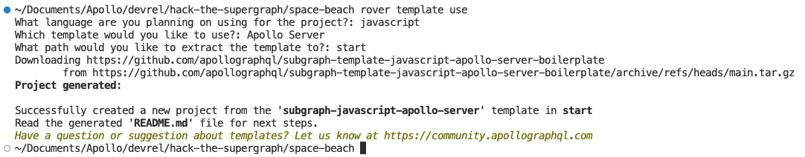
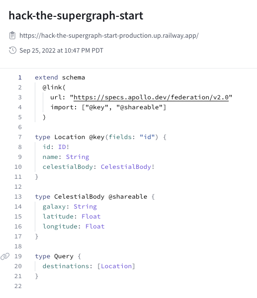

# Solar Seas - Hack the Supergraph (JavaScript)

You'll use the `schema.graphql` and `celestialMap.json` files in this folder to start the project.

## Getting Started

To start a new subgraph, we'll use `rover template use` to create a project from a template:



After `rover template use` is complete, setup the project:

```shell
npm install
```

Now replace the `schema.graphql` file in the newly created project and move the `celestialMap.json` to the `src` folder. You will need to expose the information in `celestialMap.json` on the context to be used in your resolvers. Open the `src/index.js` and add the celestial map in the context function:

```javascript
// ...
const { url } = await startStandaloneServer(server, {
  context: async ({ req }) => ({
    celestialMap: require('./celestialMap'),
  }),
  listen: { port },
});
```

Finally, you need to wire up the resolvers for your schema. Create a `src/resolvers/Location.js` for the `celestialBody` field:

```javascript
module.exports = {
  Location: {
    celestialBody(location, args, context) {
      const result = context.celestialMap.find((c) => c.id == location.id);
      return result.celestialBody;
    },
  },
};
```

Make sure your `src/resolvers/index.js` is updated to import your newly created `celestialBody` resolver.

>*NOTE: You can delete any Mutation or other resolvers from the project, they aren't needed.*

Now we can start up our subgraph and add it to our Supergraph stack locally with rover:

```shell
npm start
```

***If you still have your previous `rover dev` session running***: run `rover dev` in a new terminal window to add `solar-seas` to your local Supergraph stack.

***If you don't have your previous `rover dev` session running***:

- Run `rover dev --url=https://hack-the-supergraph-start-production.up.railway.app/ --name=start`
- In another terminal window, run `rover dev` and add `solar-seas` running locally

Now let's head over to our sandbox (*[http://localhost:3000](http://localhost:3000*) and try the same query. It should execute faster and you can view the query plan showing the starting subgraph isn't used in the query plan, the new `solar-seas` subgraph is:



We can add `solar-seas` into our Supergraph by publishing it using [rover].

First, you'll need to [Configure rover] for your Supergraph. Once rover is configured, we can use the `rover subgraph publish` command

```shell
rover subgraph publish {YOUR_SUPERGRAPH_ID}@main \
  --schema "./schema.graphql" \
  --name solar-seas \
  --routing-url "https://solar-seas-production.up.railway.app/"
```

We can see our Supergraph deployment in the "Launches" tab. Now let's open up Explorer and try running the same query in explorer to see the query execute faster.

```graphql
query AllDestinations {
  destinations {
    celestialBody {
      galaxy
    }
  }
}
```

---

Congratulations, you've completed Solar Seas! Head to either *cosmic-cove* or *space-beach* next.
