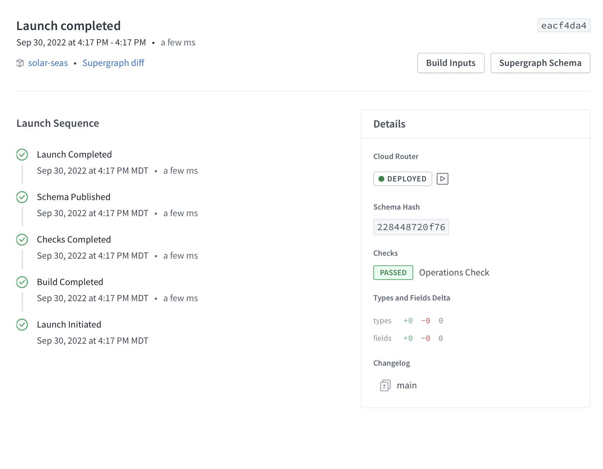

Remember our schema from the `Location` we defined at the start:

```graphql
type Location @key(fields: "id") {
  id: ID!
  celestialBody: CelestialBody! @shareable # This is what we want to override
}
```

We want to do is override the `celestialBody` of `Location` since we have a faster datasource.

This can be done using `@override` directive once we've added it to the imported directives in our schema:

```graphql
extend schema
  @link(
    url: "https://specs.apollo.dev/federation/v2.0"
    import: ["@key", "@shareable", "@override"]
  )
```

Then, we need to add the `@override` directive to `celestialBody` and declare what subgraph we want to override:

```graphql
type Location @key(fields: "id") {
  id: ID!
  celestialBody: CelestialBody! @shareable @override(from: "start")
}
```

*NOTE: If you named your starting subgraph something other than 'start', change that in your schema.*

We can add `solar-seas` into our Supergraph by publishing it using [rover].

First, you'll need to [configure rover] for your Supergraph if you haven't already. Once rover is configured, we can use the `rover subgraph publish` command in this directory to publish the complete `schema.graphql` file provided:

```shell
rover subgraph publish {YOUR_SUPERGRAPH_ID}@main \
  --schema "./schema.graphql" \
  --name solar-seas \
  --routing-url "https://solar-seas-production.up.railway.app/"
```

We can see our Supergraph deployment in the "Launches" tab:



Now let's open up Explorer and try running the same query in explorer to see the query execute faster. Congratulations, you've completed Solar Seas! Head to either *cosmic-cove* or *space-beach* next.

---

Congratulations, you've completed Solar Seas! Head to either *cosmic-cove* or *space-beach* next.
