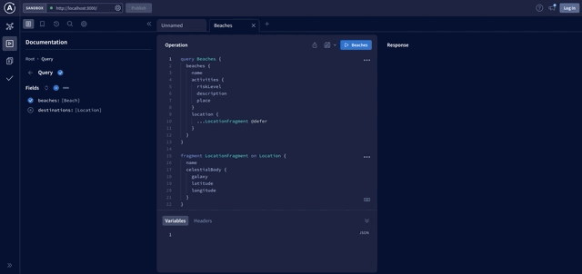

# Space Beach - Hack the Supergraph

Welcome to the beach! Beaches in space are a little different than beaches we think of on Earth. It's always fun playing games at the beach, but in space, we need to know how risky some of the activities are.

## Summary

We have all the time in the cosmos, but we want to start planning activities and where we should go based on what we can do. The beach activity information is needed right away, but the location coordinates can be deferred.

The Apollo Router supports `@defer` for any [entity] without any additional work. Since we created `Location` as an entity at the start of our journey, we can use `@defer` to ensure our graph router returns the activity information as soon as it has it. You'll use a pre-defined schema at this station. 

Let's `@defer` the location information:

## What you'll learn

- Using `@defer` in your Supergraph
- Using `rover dev` to create a Supergraph stack locally
- If you want to code...
  - Creating a new subgraph using `rover template`

<details>
 <summary><h2>I don't want to write code...</h2></summary>

You find a signal coming from [https://space-beach-production.up.railway.app/](https://space-beach-production.up.railway.app/) that contains the beach information to add into your Supergraph. There is nothing special about the beach subgraph and it actually doesn't support `@defer` itself, but the Supergraph does!

We can use `rover dev` to create a Supergraph stack locally and test out this new signal. 

First, we need to start up the Supergraph locally with our starting subgraph:

```shell
rover dev --url=https://hack-the-supergraph-start-production.up.railway.app/ --name=start
```

Now we can add our new signal to the Supergraph stack:

```shell
rover dev --url=https://space-beach-production.up.railway.app/ --name=space-beach
```

Now let's open up Sanbox at http://localhost:3000 and try deferring the location data:

```graphql
query Beaches {
  beaches {
    name
    activities {
      riskLevel
      description
      place
    }
    location {
      ...LocationFragment @defer
    }
  }
}

fragment LocationFragment on Location {
  name
  celestialBody {
    galaxy
    latitude
    longitude
  }
}
```



The Apollo Router supports `@defer` and it can work for any entity defined in your Supergraph, even if your subgraph doesn't support `@defer`. There isn't any extra code or steps, it just works.

Congratulations, you've completed Space Beach! Head to either *cosmic-cove* or *solar-seas* next.

</details>

---

<details>
 <summary><h2>I want to write code...</h2></summary>

You find an old disc on the beach that ends up containing information about beaches and the activities at them. There are `schema.graphql` and `beaches.js` files in this folder that contain the information we'll need to set up this subgraph.

The new subgraph is already started for you in the `start` folder—it's the same as you would get from `rover template use`. Switch into this directory and run `npm install` to get started. 

The `beaches.js` file uses `cross-fetch` so you'll need to install that package in the newly created project. You can do this by running `npm install cross-fetch` in the root of the project directory. 

Now replace the `schema.graphql` file in the subgraph with the one in this folder, and move the `beaches.js` to the `src` folder. You will need to expose the information in `beaches.js` on the context to be used in your resolvers. Open the `src/index.js` and add the beaches in the context function:

```javascript
const { BeachData } = require("./beaches");
...
const { url } = await startStandaloneServer(server, {
  context: async ({ req }) => ({
    beaches: new BeachData(),
  }),
  listen: { port },
});
```

Finally, you need to wire up the resolvers for your schema. There is a root `Query`, so open and modify `src/resolvers/Query.js` to use the `beaches` datasource:

```javascript
module.exports = {
  Query: {
    beaches(parent, args, context) {
      return context.beaches.getBeaches();
    },
  },
};
```

Create a `src/resolvers/Beach.js` for the activities and location:

```javascript
module.exports = {
  Beach: {
    activities(beach, args, context) {
      return context.beaches.getBeachActivities(beach.name);
    },
    location(beach, args, context) {
      return { id: beach.location };
    },
  },
};
```

>*NOTE: Notice that we only need to return the `id` for the `location`. This is because `id` is the defined key fields for the `Location`*

Make sure your `src/resolvers/index.js` is updated to import your newly created `Beach` resolver. You can delete any Mutation or other resolvers from the project, they aren't needed.

Now we can start up our subgraph and add it to our Supergraph stack locally with rover:

```shell
npm start
```

***If you still have your previous `rover dev` session running***: run `rover dev --url=http://localhost:4002 --name=space-beach` in a new terminal window to add `space-beach` to your local Supergraph stack.

***If you don't have your previous `rover dev` session running***:

- In a new terminal window, run `rover dev --url=https://hack-the-supergraph-start-production.up.railway.app/ --name=start`
- In another terminal window, run `rover dev --url=http://localhost:4002 --name=space-beach` and add `space-beach` running locally

Now let's head over to our sandbox (*[http://localhost:3000](http://localhost:3000*) and tryout a query with `@defer`:

```graphql
query Beaches {
  beaches {
    name
    activities {
      riskLevel
      description
      place
    }
    location {
      ...LocationFragment @defer
    }
  }
}

fragment LocationFragment on Location {
  name
  celestialBody {
    galaxy
    latitude
    longitude
  }
}
```


The Apollo Router supports `@defer` and it can work for any entity defined in your Supergraph, even if your subgraph doesn't support `@defer`. There isn't any extra code or steps, it just works.

</details>

---

Congratulations, you've completed Space Beach! Head to either *cosmic-cove* or *solar-seas* next.

[rover]: https://www.apollographql.com/docs/rover
[configure rover]: https://www.apollographql.com/docs/rover/configuring