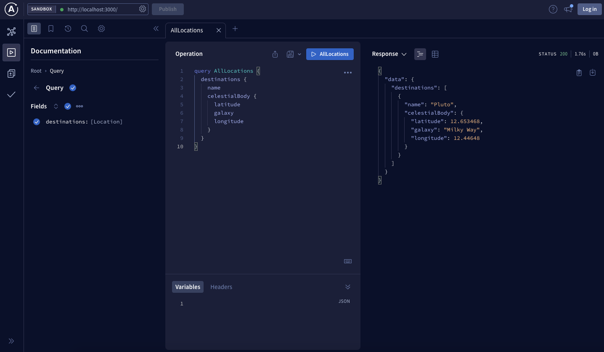

# Hack the Supergraph

Traveling across space is going to be much easier with the location information. We need to create a Supergraph and add it in.

## Start

The box has a lot of great information in it, but you need to make an upgrade. The location information is valuable, but you know you'll want to connect other data with those locations in the future. You need to upgrade the locations to be an [entity] in our Supergraph.

There are two tracks in this hackathon that build out the same Supergraph. One track is for those that don't want to write code and the others is for those that do want to write code. Feel free to take whatever path you want!

We need to upgrade the `Location` type to be an entity. Below is the schema that is being used in the box:

```graphql
type Location  {
  id: ID!
  name: String
  celestialBody: CelestialBody!
}

type CelestialBody {
  galaxy: String
  latitude: Float
  longitude: Float
}

type Query {
  destinations: [Location]
}
```

<details>
 <summary><h2>I don't want to write code...</h2></summary>

To upgrade the `Location` type to be an entity, we'll need to add the `@key` directive to the `Location` type. The `@key` directive will tell the Supergraph that the `Location` type is an entity. The `@key` directive will also tell the Supergraph what fields are needed to identify the `Location` type. In this case, the `id` field is the only field needed to identify the `Location` type.

Before doing we will to use the `@link` directive to import the `@key` directive:


```graphql
extend schema
  @link(
    url: "https://specs.apollo.dev/federation/v2.0"
    import: ["@key", "@shareable"]
  )
```

> **Note: we also imported `@shareable` we'll be using it in the next step.**

Now we can make `Location` an entity with the `@key` and we'll use the `id` field as the key:

```graphql
type Location @key(fields:"id") {
  id: ID!
  name: String
  celestialBody: CelestialBody!
}
```

`CelestialBody` contains the coordinates of a specific location and we'll need to use that type in other places in our Supergraph. For shared types, we can denote this with the `@shareable` directive on the `CelestialBody` type. We'll also add `@shareable` to `Location.celestialBody`:

```graphql
type Location @key(fields:"id") {
  id: ID!
  name: String
  celestialBody: CelestialBody! @shareable
}

type CelestialBody @shareable {
  galaxy: String
  latitude: Float
  longitude: Float
}
```

That's it! Now we've upgraded our schema to expose `Location` as an entity 🎉

Now the box is using the following schema:

```graphql
extend schema
  @link(
    url: "https://specs.apollo.dev/federation/v2.0"
    import: ["@key", "@shareable"]
  )

type Location @key(fields: "id") {
  id: ID!
  name: String
  celestialBody: CelestialBody! @shareable
}

type CelestialBody @shareable {
  galaxy: String
  latitude: Float
  longitude: Float
}

type Query {
  destinations: [Location]
}
```

Now head over to [studio.apollographql.com](https://studio.apollographql.com) and let's create our Supergraph. We can get data from the box at [https://hack-the-supergraph-start-production.up.railway.app/](https://hack-the-supergraph-start-production.up.railway.app/). Add this as your first subgraph and paste in the schema that we modified above.


>*We recommend giving this Supergraph an ID of **hack-the-supergraph-{surname}** to ensure you have a unique id. Make sure to copy the id of your Supergraph, we'll use it in other subgraph stations*

We can use the default `main` variant for this hackathon:


Congrats, you just started your Supergraph! Now navigate to explorer and query all of the available locations:

```graphql
query AllLocations {
  destinations {
    name
    celestialBody {
      galaxy
      latitude
      longitude
    }
  }
}
```


</details>

---

<details>
 <summary><h2>I want to write code...</h2></summary>

In this folder lives the code for the box (you can think of this as our existing monolith). We'll need to make a couple changes to support Apollo Federation 2:

1. Install Apollo Federation library
2. Modify schema and resolvers to define `Location` as an entity
3. Build our schema with Apollo Federation library

Let's get started by setting up the project:

```shell
npm install
```

Next we'll add the Apollo Federation library `@apollo/subgraph`:

```shell
npm install @apollo/subgraph
```

Open up `schema.graphql` and import the appropriate [Apollo Federation directives]. We will need the `@key` and `@shareable` directives:

```graphql
extend schema
  @link(
    url: "https://specs.apollo.dev/federation/v2.0"
    import: ["@key", "@shareable"]
  )
```

Now we can make `Location` an entity with the `@key` and we'll use the `id` field as the key:

```graphql
type Location @key(fields:"id") {
  id: ID!
  name: String
  celestialBody: CelestialBody!
}
```

`CelestialBody` contains the coordinates of a specific location and we'll need to use that type in other places in our Supergraph. For shared types, we can denote this with the `@shareable` directive on the `CelestialBody` type. We'll also add `@shareable` to `Location.celestialBody`:

```graphql
type Location @key(fields:"id") {
  id: ID!
  name: String
  celestialBody: CelestialBody! @shareable
}

type CelestialBody @shareable {
  galaxy: String
  latitude: Float
  longitude: Float
}
```

That's it! Now we've upgraded our schema to expose `Location` as an entity 🎉

Now the box is using the following schema:

```graphql
extend schema
  @link(
    url: "https://specs.apollo.dev/federation/v2.0"
    import: ["@key", "@shareable"]
  )

type Location @key(fields: "id") {
  id: ID!
  name: String
  celestialBody: CelestialBody! @shareable
}

type CelestialBody @shareable {
  galaxy: String
  latitude: Float
  longitude: Float
}

type Query {
  destinations: [Location]
}
```

With our schema modified, we'll need to create a resolver for the `Location` entity.

Open up `src/resolvers/Location.js`, this is where we'll define our `__resolveReference` resolver. If you look at `src/data/locations.js`, you'll see a `getLocation(id)` function that we'll want to use:

```javascript
module.exports = {
  Location: {
    __resolveReference(parent, context) {
      return context.locations.getLocation(parent.id);
    },
    async celestialBody(parent, args, context) {
      const location = await context.locations.getLocationCelestialBody(
        parent.id
      );
      return location.celestialBody;
    },
  },
};
```

The last step is to use the Apollo Federation library to build our schema.

Open `src/index.js` and modify the `ApolloServer` constructor to use `buildSubgraphSchema` instead of `typeDefs` and `resolvers` directly:

```javascript
const { buildSubgraphSchema } = require("@apollo/subgraph");

...

const server = new ApolloServer({
  schema: buildSubgraphSchema({ typeDefs, resolvers }),
});
```

Now we can start up our upgraded monolith and add it to our Supergraph:

```shell
npm start
```

[rover] provides a way for you to build and develop your Supergraph stack locally.

Try running `rover dev` and use the server you have running locally:


Now we have a graph router running locally and we can navigate to http://localhost:3000 to query our Supergraph:



After verifying everything is working locally, it's time to move to the cloud. We already have the box hosted for you at https://hack-the-supergraph-start-production.up.railway.app/.

Now head over to [studio.apollographql.com](https://studio.apollographql.com) and let's create our Supergraph in the cloud:


>*We recommend giving this Supergraph an ID of **hack-the-supergraph-{surname}** to ensure you have a unique id. Make sure to copy the id of your Supergraph, we'll use it in other subgraph stations*

We can use the default `main` variant for this hackathon:


Congrats, you just started your Supergraph! Now navigate to explorer and query all of the available locations:

```graphql
query AllLocations {
  destinations {
    name
    celestialBody {
      galaxy
      latitude
      longitude
    }
  }
}
```


</details>

---

Congratulations, you've completed the starting point of the hackathon! Head to any of the subgraph stations (*cosmic-cove*, *solar-seas* or *space-beach*) next.

[entity]: https://www.apollographql.com/docs/federation/entities
[Apollo Federation directives]: https://www.apollographql.com/docs/federation/federated-types/federated-directives
[rover]: https://www.apollographql.com/docs/rover/
