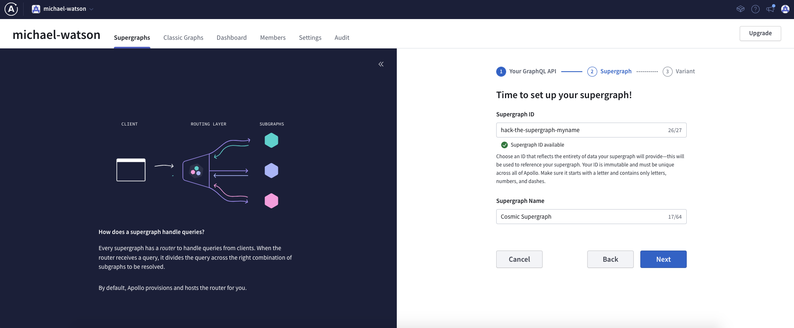
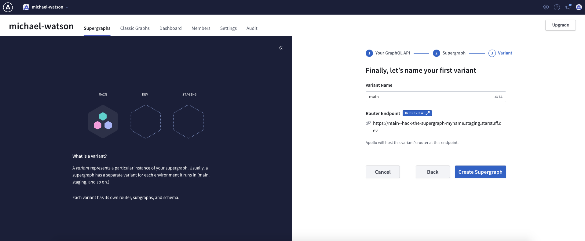

# Hack the Supergraph (No code)

Traveling across space is going to be much easier with the location information. We need to create a Supergraph and add it in.

## Summary

This subgraph is the starting point of the Hack the Supergraph journey where you will begin creating your Supergraph. At this station you will be introduced to creating a `Location` [entity] that will be used throughout the hackathon. 

## What you'll learn

- Upgrading your GraphQL Server to support Apollo Federation 2
- Defining an [entity] in your schema
- Creating a Supergraph with Apollo

## Start

The completed Planisphere's schema (`apollo-lounge-start/schema.graphql`) is ready for you to push into your Supergraph. Before we do that, let's look at what the Planisphere's schema looked like before getting to the completed version:

```graphql
type Location {
  id: ID!
  name: String
  celestialBody: CelestialBody!
}

type CelestialBody {
  galaxy: String
  latitude: Float
  longitude: Float
}

type Query {
  destinations: [Location]
}
```

We need the `Location` type to be available to other subgraphs and we do this by defining it as an [entity]. To define an entity in our subgraph schema, we first need to import the `@key` and `@shareable` Apollo Federation directives:

```graphql
extend schema
  @link(
    url: "https://specs.apollo.dev/federation/v2.0"
    import: ["@key", "@shareable"]
  )
```

Now we can make `Location` an [entity] by using `@key` and defining the key fields, which is `id` in our case:

```graphql
type Location @key(fields:"id") {
  id: ID!
  name: String
  celestialBody: CelestialBody!
}
```

`CelestialBody` contains the coordinates of a specific location and we'll need to use that type in other places in our Supergraph. Shared types can be created by using the `@shareable` directive; `CelestialBody` will be shared in other subgraphs:

```graphql
type Location @key(fields:"id") {
  id: ID!
  name: String
  celestialBody: CelestialBody! @shareable
}

type CelestialBody @shareable {
  galaxy: String
  latitude: Float
  longitude: Float
}
```

That's it! Now we've talked about how the schema was upgrade to expose `Location` as an entity 🎉

Now head over to [studio.apollographql.com](https://studio.apollographql.com) and let's create our Supergraph. We can get data from the Planisphere at [https://hack-the-supergraph-start-production.up.railway.app/](https://hack-the-supergraph-start-production.up.railway.app/). Add this as your first subgraph and make sure to name it.




>*We recommend giving this Supergraph an ID of **hack-the-supergraph-{surname}** to ensure you have a unique id. Make sure to copy the id of your Supergraph, we'll use it in other subgraph stations*

We can use the default `main` variant for this hackathon:



Congrats, you just started your Supergraph! Now navigate to explorer and query all of the available locations:

```graphql
query AllLocations {
  destinations {
    name
    celestialBody {
      galaxy
      latitude
      longitude
    }
  }
}
```


---

Congratulations, you've completed the starting point of the hackathon! Head to any of the subgraph stations (*cosmic-cove*, *solar-seas* or *space-beach*) next.

[entity]: https://www.apollographql.com/docs/federation/entities
[Apollo Federation directives]: https://www.apollographql.com/docs/federation/federated-types/federated-directives
[rover]: https://www.apollographql.com/docs/rover/
